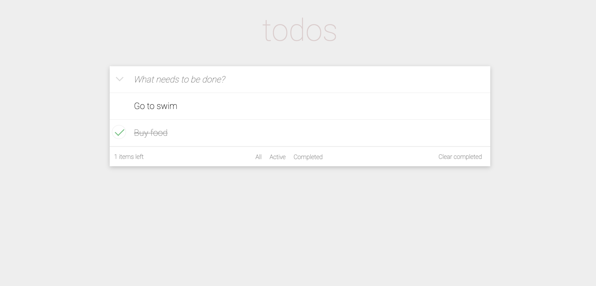

<h1 style='text-align: center;'>TODO приложение</h1>

### Приложение списка дел с возможностью добавления, маркировки, сортировки и удаления дел.

В данной работе использованы технологии:
- HTML;
- CSS;
- React.

# Для запуска приложения необходимо:
- Запустить "GitBash"("Terminal" на Mac OS);
- Выполнить команду "git clone https://github.com/Gonzoooo/todo-react.git";
- Выполнить команду "cd todo-react";
- Выполнить команду "npm install";
- Выполнить команду "npm start"
